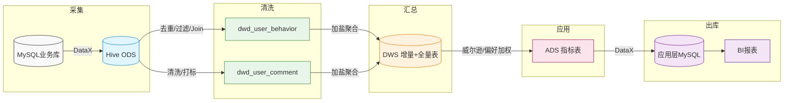

# 🚀 电商大数据平台：从数据采集到深度分析的全链路数仓实战
                    
* 本项目构建了一个企业级的电商离线数仓系统，涵盖了从原始日志采集、清洗、多层建模到最终指标导出的全流程
* 前置要求：配置 **spark on hive**
## 🏗️ 1. 数仓建模思路与业务背景
本项目遵循 维度建模（Dimensional Modeling） 理论，采用自下而上的四层架构（ODS -> DWD -> DWS -> ADS）

#### 📐 建表策略详解为了平衡查询性能与存储效率，本项目在建表时采用了以下优化手段： 

* 存储格式： 除了ODS层外,全线采用 ORC 格式存储。相比 TextFile，ORC 提供的列式存储和索引能提升 Spark 约 3-5 倍的查询速度，并大幅降低 HDFS 空间占用
  
* 分区设置（Partitioning）： 统一以 dt (日期) 作为一级分区字段，实现动态分区加载，避免全表扫描，满足 ODS 每日增量同步的需求
  
* 分桶设计（Bucketing）：  在 ODS 层对维度表针对 user_id 和 category_id 进行分桶
  
* 分桶意义： 预先打散数据，使得在后续 DWD 和 DWS 层的 Join 或 Group By 操作中，Spark 可以实现 *Bucket-Pruning* 和 *Sort-Merge Join*，彻底消除大规模 Shuffle 带来的性能损耗

#### 📁 建表详情：
 1. ODS 层 (原始数据层)
- 此层保持数据原貌，主要解决外部数据（MySQL/CSV）进入 Hadoop 的问题

|表名          |     说明     |业务背景|文件类型|分区设置|分桶设置|
| :-------------:|------------|-------------|-----------|--------|----------|
|user_behavior_inc|用户行为增量表|存储每日从业务系统同步过来的原始行为日志|TEXTFILE|partition(dt='yyyyMMdd')|不分桶|
|user_comment_inc |用户评论增量表|存储每日同步的原始用户评论文本|TEXTFILE|partition(dt='yyyyMMdd')|不分桶|
|ods_user_face_full|用户画像全量表|存储用户职业、年龄等静态画像信息|TEXTFILE|partition(dt='yyyyMMdd')|按照user_id分桶|
|ods_category_mapping_full|商品类目映射表|存储商品 ID 与类目名称的映射关系|TEXTFILE|partition(dt='yyyyMMdd')|按照category_id分桶|

  2. DWD 层 (明细数据层)
- 此层进行数据清洗、脱敏、关联维表及 NLP 处理。

|表名          |       说明       |   行为逻辑   |文件类型   |分区设置|  分桶设置 |
| :-------------:|-----------------|-------------|------------|:--------:|----------|
|dwd_user_behavior|行为明细事实表|关联用户画像和商品类目，去重过滤空值|    ORC    |partition(dt='yyyyMMdd')|不分桶|
|dwd_user_comment|评论明细事实表|集成 Jieba 分词，进行情感打标（好评1/差评0）并关联维表|    ORC    |partition(dt='yyyyMMdd')|不分桶|

 3. DWS 层 (服务数据层)
- 此层按主题进行聚合，包含“当日增量聚合”和“历史全量快照”

|表名          |说明|指标内容|文件类型|分区设置|分桶设置|
| :-------------:|-----------------|---------------|---------|--------|----------|
|dws_face_day|职业主题日增表|各职业在各商品类目下的 浏览、收藏、购买总数|  ORC  |partition(dt='yyyyMMdd')|不分桶|
|dws_goods_day|商品流量日主题表|商品类目维度的全站流量统计|  ORC  |partition(dt='yyyyMMdd')|不分桶|
|dws_goods_reputation_day|商品口碑日主题表|累计评论数、好评数、差评数|  ORC|  partition(dt='yyyyMMdd')|不分桶|
|dws_face_full|职业*历史*主题表|各职业在各商品类目下的 浏览、收藏、购买总数|  ORC  |partition(dt='yyyyMMdd')|不分桶|
|dws_goods_full|商品流量*历史*主题表|商品类目维度的全站流量统计|  ORC  |partition(dt='yyyyMMdd')|不分桶|
|dws_goods_reputation_full|商品口碑*历史*主题表|累计评论数、好评数、差评数|  ORC  |partition(dt='yyyyMMdd')|不分桶|

 4. ADS 层 (应用数据层)
- 面向业务端的最终指标表
  
|     表名          |       说明       |          算法            |文件类型   |分区设置|  分桶设置 |
|:-----------------:|-----------------|:--------------------------:|---------|--------|----------|
|ads_goods_pop      |    当日人气榜   |加权得分排行 Top 100         |ORC     |partition(dt='yyyyMMdd')|不分桶|
|ads_face_favorite  |    职业偏好榜   |加权得分排行 Top 3           |ORC     |partition(dt='yyyyMMdd')|不分桶|
|ads_goods_pv_to_buy|    商品转化榜    |基于威尔逊下限算法的转化率   |ORC     |partition(dt='yyyyMMdd')|不分桶|
|ads_goods_score    |    商品口碑榜   |基于威尔逊下限算法的好评率    |ORC     |partition(dt='yyyyMMdd')|不分桶|

## ⚙️ 2. 集群环境与技术栈配置
#### 本项目采用了严格的环境隔离方案，通过 Miniforge3 实现了计算引擎与调度引擎的 Python 环境解耦

#### 组件版本说明：

|   组件   |   版本  |                说明             |   配置  |
|:----------:|:---------:|:-------------------------------:|:---------:|
| Rocky    | linux 9 | 企业级 RHEL 系稳定内核          |   系统   |
| Hadoop   | 3.3.6   | 分布式存储与 YARN 资源管理      |  集群模式|
| Hive     | 3.1.3   | 元数据管理与 ODS 接入           |  hive on hadoop |
| Spark    | 3.5.8   | 核心计算引擎 (PySpark)          |  spark on yarn |
| Airflow  | 2.5.1   | 全链路 DAG 任务调度             |  单机    |
| Datax    | 3.0     | 异构数据同步 (HDFS ↔ MySQL)     |   单机   |
| Mysql    |  8.0    | hive和airflow的元数据库以及业务数据库           |   单机   |

#### 🐍 Python 运行环境管理工具： Miniforge3 (Conda 兼容)

* Spark 环境： Python 3.9
* Airflow 环境： Python 3.10 (利用高版本 Python 提升调度器并发效率)

## 🔄 3. 任务流转与数据血缘
#### 整个 pipeline 通过 Airflow 编排，数据在各层间经历了从“脏数据”到“黄金指标”的蜕变：

- **L-M-H 环节 (Linux -> MySQL -> Hive)**
  - 通过 DataX 将业务库数据抽取至 Hive ODS 层分区表
- **ODS ➔ DWD (清洗层)**
  - 动作： 去重、空值过滤、用户画像 Join
  - 产出： dwd_user_behavior (行为明细表)、dwd_user_comment (评论打标表)
- **DWD ➔ DWS (汇总层)**
  - 策略： 同时进行增量聚合（当日指标）与全量聚合（历史快照合并）
  - 技术点： 引入局部加盐（Salting）处理计算倾斜
- **DWS ➔ ADS (应用层)**
  - 威尔逊下限算法、职业偏好加权计算
- **ADS ➔ MySQL**
  - 指标出库，供 BI 展示

#### 流程图：

## ⚡ 4. 压测报告：5000万级数据性能表现测试集规模： 
#### 注：测试所用集群为：主节点 5g 4核，两个从节点 3g 3核
### 用户行为  + 商品评论 +历史维度数据 ≈ 50,000,000 条,3G的数据
通过对 YARN 内存分配的深度优化（调整 `executor.memory` 为 800M，压低 `maxPartitionBytes`），集群展现了卓越的处理效率

#### ⏱️ 性能耗时清单： (总计约 22 分钟)

* 数据抽取环节 (L-M-H)： 15 min (瓶颈在于网络 IO 与 MySQL 读取)
* 清洗转换 (ODS -> DWD)： 4 m 14 s (Spark 向量化执行优势显现)
* 数据聚合 (DWD -> DWS)： 1 m 30 s (加盐策略成功化解数据倾斜)
* 深度建模 (DWS -> ADS)： 39 s (ORC 分桶读取加速查询)
* 结果出库 (ADS -> MySQL)： 49 s (DataX 多 Channel 并发写入)

## 🛡️ 5. 任务治理与任务监控

#### 📧 邮件预警系统在 Airflow 中通过 EmailOperator 与 default_args 深度集成：

* 失败即通知： 任何任务实例失败，第一时间向管理员邮箱发送错误日志。
* 状态全闭环： 支持任务重启（Retry）通知及全量任务成功报告。

#### 💾 集群内存调优针对 Rocky Linux 9 与 Spark 3.5.8 的特性，进行了以下资源适配：

* 动态申请： 开启 `spark.dynamicAllocation.enabled`，根据负载自动伸缩 Executor 数量。
  
* 并行度优化： 根据 YARN 虚拟核数比例调整 `spark.sql.shuffle.partitions=24`，确保 CPU 核心始终处于满载状态，绝无空闲等待。

